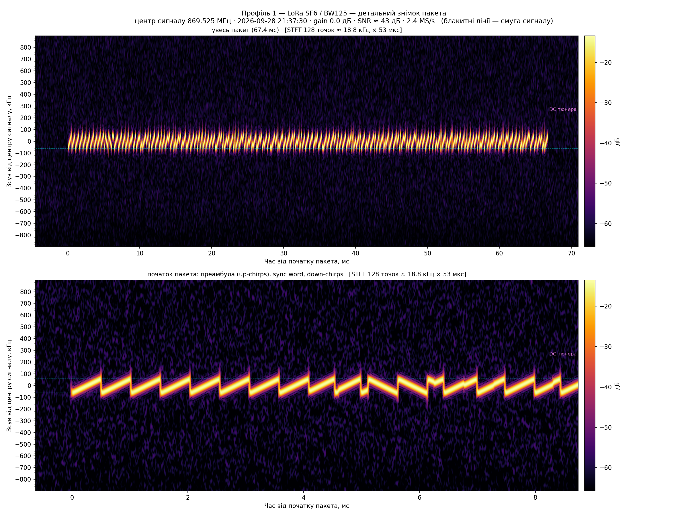

# LoRa/FSK: передача даних і порівняння модуляцій

Два радіомодулі SX1276 (LilyGo TTGO T3 v1.6.1: ESP32 + SX1276 + OLED 128×64 + енкодер) обмінюються
даними; вимірюється, як параметри LoRa (SF, BW) і модуляція FSK впливають на час передачі пакета,
а сигнал кожного режиму перевіряється на waterfall.

## Завдання

1. **Передача й прийом** — один пристрій передає, другий приймає; тестове повідомлення приймається коректно.
2. **Швидкість LoRa** — час передачі пакета 64 байти для SF6/SF12 × BW 125/500 кГц.
3. **LoRa проти FSK** — той самий пакет через `beginFSK()`, bitrate 15 200 і 100 000, f_dev = bitrate.
4. **Дальність** — максимальна відстань стабільного прийому для конфігурацій рівня 2.
5. **Прихований рівень** — вигляд сигналів LoRa і FSK на waterfall (SDR).

## Підхід

Замість двох окремих прикладів (передавач / приймач) — одна прошивка для обох пристроїв; роль
**База** (передавач) чи **Ровер** (приймач) задається при збірці. Пристрої спершу
синхронізуються на надійному службовому каналі, далі за командою з меню проходять усі режими:

- **Вимірювання (MEAS)** — автоматично, по черзі 6 профілів (4 LoRa + 2 FSK), по 8 пакетів × 64 байти.
  База вимірює фактичний час передачі кожного пакета, Ровер фіксує прийом, RSSI і SNR.
- **Тест частот (TEST)** — профіль вибирається енкодером, пачки йдуть по колу; для огляду на SDR і
  для перевірки дальності.

Кожен пакет і подія записуються в лог на обох пристроях; логи забираються по Wi-Fi у браузерний
переглядач, який зводить База/Ровер по профілях. Сигнали знімаються RTL-SDR і скриптом, що будує
waterfall для кожного профілю.

## Рішення

**Прошивка** (PlatformIO, Arduino, RadioLib, U8g2):

| Задача / ядро | Відповідальність |
|---|---|
| `loop()`, ядро 1 | протокол, радіо, меню, лог, Wi-Fi — неблокуюче |
| `inputTaskFunc`, ядро 0 | опитування енкодера (1 мс) |
| `displayTaskFunc`, ядро 0 | рендер OLED |

| Модуль | Роль |
|---|---|
| [SessionState](src/SessionState.h) | стан-машина: синхронізація, старт/стоп режимів, цикл «пачка + слот» |
| [RadioManager](src/RadioManager.h) | RadioLib SX1276: службовий канал і 6 профілів, вимірювання часу TX |
| [AirtimeBudget](src/AirtimeBudget.h) | облік duty cycle за ковзну годину |
| [FlashLog](src/FlashLog.h) | лог у внутрішній flash (LittleFS), експорт CSV |
| [WifiOffload](src/WifiOffload.h) | HTTP: `/info`, `/logs.csv`, стирання логів |
| [Menu](src/Menu.h) · [Display](src/Display.h) · [Encoder](src/Encoder.h) | інтерфейс |
| [Config.h](include/Config.h) | піни, частоти, профілі, таймінги |

**Радіо:**

| Канал | Модуляція | Частота |
|---|---|---|
| службовий (синхронізація, керування) | LoRa SF10 / BW125, пакет 4 байти | 869.525 МГц |
| профіль 1 | LoRa SF6 / BW125 | 869.525 МГц |
| профіль 2 | LoRa SF6 / BW500 | 868.300 МГц |
| профіль 3 | LoRa SF12 / BW125 | 869.525 МГц |
| профіль 4 | LoRa SF12 / BW500 | 868.300 МГц |
| профіль 5 | FSK bitrate 15 200, f_dev 15 200 | 869.525 МГц |
| профіль 6 | FSK bitrate 100 000, f_dev 100 000 | 868.300 МГц |

- Піддіапазони за ETSI EN 300 220: 869.40–869.65 МГц (duty cycle 10%) для вузьких сигналів,
  868.0–868.6 МГц (1%) для ширших за 250 кГц. Потужність 14 дБм, duty cycle контролюється прошивкою.
- Час передачі — від `startTransmit()` до переривання TX-done (DIO0), тобто фактичний, а не розрахунковий.
- SF6 працює в implicit-header режимі; FSK — у режимі фіксованої довжини пакета 64 байти.
- Синхронізація й усі команди — лише на службовому каналі з підтвердженнями (REQ→ACK); хардбіти
  Бази й Ровера рознесені в часі.

**Аналіз:** [radioanalysis/lora_waterfall](radioanalysis/lora_waterfall) — запис RTL-SDR Blog V4 і
побудова waterfall: огляд усього запису і детальний знімок одного пакета з налаштуванням STFT
під модуляцію.

## Інструкція

1. Прошивка: `pio run -e base -t upload`, `pio run -e rover -t upload`. На старті пристрій
   проходить самотест (живлення, NVS, радіо, OLED, flash, конфіг, причина попереднього
   перезапуску): «Самотест OK» зникає сам, збій лишається на екрані до натискання. Деталі —
   команда `post`.
2. Wi-Fi (одноразово на кожному пристрої): `IDLE` → «Сервіс → Налаштувати Wi-Fi» → підключити
   телефон до мережі `ttgo-lora-bench-XXXXXX` з паролем з екрана → на сторінці
   (192.168.4.1, відкривається сама) вибрати мережу й ввести пароль → натиснути енкодер. Або в
   консолі `wifi add <ssid> <пароль>` (SSID із пробілами — у лапках). До 4 мереж, зберігаються в
   NVS і переживають перепрошивку. Для
   локальних збірок є ще `include/secrets.h` (`cp include/secrets.example.h include/secrets.h`) —
   ці мережі пробуються після збережених; релізні образи їх не містять.
3. На будь-якому пристрої: меню → «Синхронізація [почати]» → після `SYNC` → «Вимірювання [почати]»
   або «Тест частот [почати]» (профіль — обертанням енкодера).
4. Логи: `IDLE` → «Сервіс → Передати по Wi-Fi» → відкрити
   [doc/LoRa_PC_viewer_makett.html](doc/LoRa_PC_viewer_makett.html), ввести IP обох пристроїв.
5. Waterfall (пристрої в TEST):
   `cd radioanalysis/lora_waterfall && ~/radioconda/bin/python run_all.py --open`.
6. Консоль: `pio device monitor -e base` (або `-e rover`) → `help`. Команди: `version`,
   `log [n|all]`, `log level error|warn|info|debug`, `log clear`, `log stats`, `reboot`,
   `post`, `ota [status]|check|update [--force]|cancel`, `wifi list|add|del`, `config [show]`, `config get|set <ключ> [значення]`,
   `config reset`, `config stress [n]`, `config tear-test`. Параметри конфігурації: `log_level` (рівень системного логу після старту,
   0–3 або `error`…`debug`), `ota_url` (адреса маніфесту оновлень), `wifi_timeout_s` (секунд на
   одну мережу Wi-Fi, 3–30) і `portal_timeout_min` (автозакриття налаштування Wi-Fi, 1–60 хв); `session_id` — лише для
   читання. Конфіг зберігається у двох копіях із CRC, тож обрив живлення під час запису не
   губить попередні значення.
   У режимі Wi-Fi ті самі команди — `POST /cmd` (тіло — рядок команди; `wifi add/del` — лише
   з Serial), а також `GET /version`, `GET /syslog`. `GET /info` показує й результат
   самотесту (`post` — маска збоїв, 0 = OK) та напругу акумулятора.
7. Оновлення прошивки: `IDLE` → «Сервіс → Оновити прошивку» (або `ota update` у консолі).
   Див. розділ «Оновлення по Wi-Fi» нижче.

## Версії та релізи

Версія прошивки не прописується вручну: [scripts/version.py](scripts/version.py) бере її з git-тегу
`hw6-vX.Y.Z` (між релізами — `X.Y.Z-<комітів>-g<hash>`, з незакоміченими змінами — `-dirty`) і
передає в збірку параметрами `-D`. Реліз — це push тегу: GitHub Actions збирає обидві ролі з
чистого дерева й публікує [Release](https://github.com/RomanLobach/GF_Course/releases) з образами
та `manifest.json` (розмір і SHA-256 кожного образу). Зміни — у [CHANGELOG.md](CHANGELOG.md).

## Оновлення по Wi-Fi

Пристрій сам завантажує нову версію з GitHub Releases: читає `manifest.json` з адреси
`ota_url` (за замовчуванням — ковзний реліз `hw6-latest`, HTTPS із вшитими кореневими
сертифікатами), бере образ своєї ролі й ставить його, лише якщо версія новіша (`--force` —
будь-яку). Образ пишеться в неактивний розділ шматками по 4 КБ, паралельно рахуються SHA-256 і
розмір; якщо щось не збіглося або зв'язок обірвався — запис скасовується, і пристрій лишається на
поточній прошивці. Завантаження йде в окремій задачі, радіо на цей час на паузі; прогрес — на
OLED і в `ota status`, натискання енкодера скасовує.

Відкат: нова прошивка після першого старту лишається «на перевірці» і підтверджується, лише якщо
самотест пройшов і роль збігається з тією, з якою плату прошили вперше. Інакше вона позначається
недійсною, і завантажувач повертає попередню. Прошивка кабелем під перевірку не потрапляє.

Для розробки й демо відкату — локальний сервер [scripts/ota_server.py](scripts/ota_server.py)
(маніфест з образів `.pio/build`, `config set ota_url http://<ПК>:8000/manifest.json`).

## Польова готовність

- [Специфікація протоколу](doc/protocol_spec.md) — формат кадрів, типи повідомлень, таймаути,
  реальні пакети в HEX із розбором.
- [Польовий чекліст](doc/field_checklist.md) — 12 перевірок «що → як → критерій».
- [Оновлення по Wi-Fi і відкат](doc/ota_update.md) — як влаштовано і перевірка на платі:
  встановлення, відкат образу зі збоєм самотесту, обрив зв'язку, скасування з меню.
- [Експеримент з обривом живлення](doc/power_cut_experiment.md) — плата стартує з останнім
  повністю записаним конфігом.
- [Логи консолі з плат](doc/logs/) — `version`, `post`, `config get/set/reset`, міграція конфігу, OTA і відкат,
  межі значень, прохід вимірювання, службові пакети.

## Результати

Вимірювання 2026-09-28. Джерело даних —
[doc/lora-log-export.csv](doc/lora-log-export.csv) (експорт логів обох пристроїв); час передачі —
середнє за 16 пакетів на профіль (2 проходи), розкид ±0.05 мс. 

### Рівень 1 — передача і прийом

База передала, Ровер прийняв 48 із 48 пакетів (6 профілів × 8), кожен пакет записаний у лог обох
пристроїв з RSSI/SNR. Прийняті дані відображаються на екрані Ровера (профіль, кількість
прийнятих пакетів, RSSI, SNR) і в браузерному переглядачі.

### Рівень 2 — швидкість LoRa

| SF | BW | Розмір пакета | Час передачі | Корисна швидкість | RSSI / SNR на Ровері |
|---|---|---|---|---|---|
| SF6 | 125 кГц | 64 байти | 68.4 мс | 7.5 кбіт/с | −17 дБм / 6.9 дБ |
| SF6 | 500 кГц | 64 байти | 18.4 мс | 27.8 кбіт/с | −12 дБм / 3.0 дБ |
| SF12 | 125 кГц | 64 байти | 2795.2 мс | 0.18 кбіт/с | −12 дБм / 9.9 дБ |
| SF12 | 500 кГц | 64 байти | 618.2 мс | 0.83 кбіт/с | −21 дБм / 4.7 дБ |

- Збільшення BW у 4 рази скорочує час передачі в 3.7× (SF6) і 4.5× (SF12).
- Перехід SF6 → SF12 збільшує час у 41× (BW125) і 34× (BW500): кожен крок SF подвоює тривалість символу.
- Різниця між найшвидшою і найповільнішою конфігурацією — 152×.

### Рівень 3 — LoRa проти FSK

| Модуляція | Параметри | Розмір пакета | Час передачі | Корисна швидкість | RSSI на Ровері |
|---|---|---|---|---|---|
| FSK | bitrate 15 200, f_dev 15 200 | 64 байти | 38.2 мс | 13.4 кбіт/с | −5 дБм |
| FSK | bitrate 100 000, f_dev 100 000 | 64 байти | 6.9 мс | 74.2 кбіт/с | −67 дБм |

SNR для FSK модуль SX1276 не вимірює.

- FSK 100 000 — найшвидший режим: у 2.7× швидше за найшвидшу LoRa (SF6/BW500) і в 405× швидше за SF12/BW125.
- FSK 15 200 — у 1.8× швидше за SF6/BW125, але в 2.1× повільніше за SF6/BW500.
- Швидкість FSK визначається лише bitrate; LoRa платить часом за завадостійкість (розширення спектра).

У режимі TEST (116 пачок по 4 пакети) доставка на малій відстані: SF12/BW125, SF12/BW500 і FSK 15 200 —
100%, SF6/BW125 — 99.6%, FSK 100 000 — 97%, SF6/BW500 — 91%.

### Рівень 4 — дальність

Не виконувався. Прошивка для цього готова: у режимі TEST на екрані Ровера — прийнято X/Y, RSSI,
SNR для вибраного профілю, результати кожної пачки пишуться в лог. Поки не було нагоди поміряти на дальність: нормальну робочу прошивку тільки завершив.
О 22й по Запоріжжю з випромінювачем на південних околицях просто поки лячно міряти, але поміряю дальність з годом.

### Прихований рівень — waterfall

RTL-SDR Blog V4, 2.4 MS/s, gain 0 дБ. Огляд — увесь запис: пачка з 4 пакетів, службові пакети
між пачками, межі піддіапазонів. Деталь — один пакет і збільшений початок (преамбула, sync word).

| Профіль | Що видно | Знімки |
|---|---|---|
| LoRa SF6 / BW125 | чирпи 0.5 мс у смузі ±62.5 кГц; 8 up-chirps, sync, 2.25 down-chirps | [огляд](radioanalysis/lora_waterfall/captures/20260928/P1_LoRa_SF6_BW125_213730_overview.png) · [деталь](radioanalysis/lora_waterfall/captures/20260928/P1_LoRa_SF6_BW125_213730_detail.png) |
| LoRa SF6 / BW500 | у 4× ширша смуга, у 4× коротші чирпи | [огляд](radioanalysis/lora_waterfall/captures/20260928/P2_LoRa_SF6_BW500_213843_overview.png) · [деталь](radioanalysis/lora_waterfall/captures/20260928/P2_LoRa_SF6_BW500_213843_detail.png) |
| LoRa SF12 / BW125 | пакети по ~2.8 с, найдовший режим | [огляд](radioanalysis/lora_waterfall/captures/20260928/P3_LoRa_SF12_BW125_213919_overview.png) |
| LoRa SF12 / BW500 | повільні чирпи на всю смугу 500 кГц | [огляд](radioanalysis/lora_waterfall/captures/20260928/P4_LoRa_SF12_BW500_214125_overview.png) · [деталь](radioanalysis/lora_waterfall/captures/20260928/P4_LoRa_SF12_BW500_214125_detail.png) |
| FSK 15 200 | два тони ±15.2 кГц, вузька смуга | [огляд](radioanalysis/lora_waterfall/captures/20260928/P5_FSK_15200_214207_overview.png) · [деталь](radioanalysis/lora_waterfall/captures/20260928/P5_FSK_15200_214207_detail.png) |
| FSK 100 000 | два тони ±100 кГц, пакет ~7 мс | [огляд](radioanalysis/lora_waterfall/captures/20260928/P6_FSK_100000_214237_overview.png) · [деталь](radioanalysis/lora_waterfall/captures/20260928/P6_FSK_100000_214237_detail.png) |

LoRa SF6 / BW125, початок пакета:

## Висновки

- Два пристрої стабільно обмінюються даними: 48 із 48 пакетів у проході вимірювання.
- Час передачі LoRa зростає експоненційно з SF (×2 на кожен крок) і обернено пропорційний BW;
  між SF6/BW500 і SF12/BW125 — 152×.
- FSK 100 000 передає 64 байти за 6.9 мс — найшвидше з усіх режимів; FSK 15 200 за швидкістю
  лежить між LoRa SF6/BW125 і SF6/BW500.
- На waterfall режими чітко розрізняються: LoRa — лінійні чирпи, ширина яких дорівнює BW, а нахил
  залежить від SF; FSK — два фіксовані тони на відстані 2 × f_dev.
