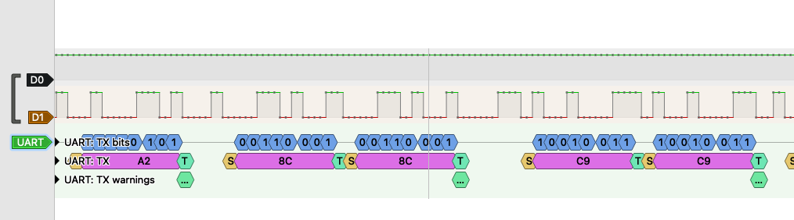

# LoRa-керування навантаженням із GPS-трекером на передавачі

Репозиторій об'єднує виконання трьох домашніх завдань курсу на базі двох апаратних прототипів (передавач і приймач), побудованих на платах **LILYGO TTGO LoRa32 T3 V1.6.1** (ESP32 + вбудований SX1276, 868 MHz).

## Зміст

- [Огляд системи](#огляд-системи)
- [Домашнє завдання 1 — базові вимірювання на девборді](#домашнє-завдання-1--базові-вимірювання-на-девборді)
- [Домашнє завдання 2 — «Сенсор → актуатор»](#домашнє-завдання-2--сенсор--актуатор)
- [Домашнє завдання 3 — SPI своїми руками](#домашнє-завдання-3--spi-своїми-руками)
- [Задача зі зірочкою — GPS по UART](#задача-зі-зірочкою--gps-по-uart)
- [I2C: моніторинг напруги/струму (INA226)](#i2c-моніторинг-напругиструму-ina226)
- [Структура репозиторію](#структура-репозиторію)
- [Схеми](#схеми)
- [Фото та відео](#фото-та-відео)
- [Збірка та прошивка](#збірка-та-прошивка)

## Огляд системи

Два ESP32-прототипи обмінюються командами по LoRa на 868 MHz:

- **Передавач** — має кнопку, баззер і GPS-модуль (NEO-6M). При натисканні кнопки видає короткий звуковий сигнал і надсилає по LoRa команду перемикання стану лампи. На дисплеї виводить час роботи та GPS-координати.
- **Приймач** — отримує команду по LoRa, керує світлодіодним модулем 12V через MOSFET-модуль, контролює напругу/струм/потужність навантаження через INA226 і миттєво відключає навантаження при перевищенні безпечних порогів. Стан і вимірювання виводяться на дисплей.

Обидва прототипи побудовані на **повністю рукописному, bare-metal SPI-драйвері** (без апаратного `spi_master` і без зовнішніх бібліотек) для роботи з чипом SX1276.

## Домашнє завдання 1 — базові вимірювання на девборді

Виконано в частині вимірювання напруги на пінах різних модулів (живлення, лінії UART) під час діагностики підключення GPS-модуля до передавача. Для перевірки коректності UART-протоколу (стан ліній TX/RX, формат кадру 8N1) використовувався логічний аналізатор.

Скріншот: 

## Домашнє завдання 2 — «Сенсор → актуатор»

Реалізовано в частині приймача: пристрій отримує команду по LoRa (сенсор події — натискання кнопки на іншому пристрої) і на її основі керує актуатором — MOSFET-модулем, який комутує живлення світлодіодного модуля 12V. Джерело 12V — окрема плата-тригер, що бере напругу з PD-блока живлення (на схемі не позначена окремо).

## Домашнє завдання 3 — SPI своїми руками

Реалізовано власний драйвер SPI на рівні бітів (`components/bitbang_spi`) — **однаковий для обох прототипів**, без використання апаратного `driver/spi_master.h` чи будь-яких зовнішніх бібліотек. Увесь протокол (тактові імпульси SCK, виставлення MOSI, читання MISO, керування NSS/CS) реалізований через прямі `gpio_set_level`/`gpio_get_level`.

На основі цього драйвера побудований протокольний рівень для чипа **SX1276** (`components/sx1276`) — ідентичний в обох прототипах, з симетричним API (`sx1276_send` / `sx1276_receive`).

Прототипи передавача й приймача були зроблені саме для наскрізної перевірки цього SPI-драйвера в реальних умовах (детекція чипа за регістром версії, передача та прийом пакетів на 868 MHz).

## Задача зі зірочкою — GPS по UART

Реалізовано в прототипі передавача: GPS-модуль NEO-6M (GY-GPS6MV2) підключений по UART, прошивка розбирає NMEA-речення `$GPGGA`/`$GNGGA` та `$GPGSV` (координати, кількість супутників, HDOP, висота). Контроль здійснювався одночасно двома способами:

1. Логами по послідовному порту в терміналі (скріншот: `log_screen.png`);
2. На дисплеї самого прототипу (час роботи з моменту старту, кількість супутників, широта/довгота).

## I2C: моніторинг напруги/струму (INA226)

У прототипі приймача реалізовано роботу з протоколом I2C для контролю навантаження: модуль **INA226** вимірює напругу, струм і потужність світлодіодного модуля, дані виводяться на дисплей та використовуються для програмного захисного відключення (перевищення струму, напруги або потужності над заданими порогами миттєво знімає керування з MOSFET, незалежно від останньої команди по LoRa).

## Структура репозиторію

```
.
├── transmitter/                  # прототип-передавач (кнопка, баззер, GPS, дисплей)
│   ├── platformio.ini
│   ├── src/
│   └── components/
│       ├── bitbang_spi/          # рукописний bit-bang SPI-драйвер
│       ├── sx1276/               # драйвер LoRa-чипа на основі bitbang_spi
│       ├── gps_nmea/             # парсер NMEA (UART)
│       ├── button/               # опитування + антидребезг кнопки
│       ├── buzzer/                # неблокуюче керування баззером
│       └── ssd1306/               # драйвер OLED-дисплея
│
├── receiver/                     # прототип-приймач (LoRa -> MOSFET, INA226, дисплей)
│   ├── platformio.ini
│   ├── src/
│   └── components/
│       ├── bitbang_spi/          # той самий SPI-драйвер, що й у передавачі
│       ├── sx1276/               # той самий LoRa-драйвер
│       ├── ina226/               # драйвер моніторингу напруги/струму/потужності
│       └── ssd1306/               # драйвер OLED-дисплея
│
├── led_control_via_lora_transmitter.pdf   # схема прототипу-передавача
├── led_control_via_lora_receiver.pdf      # схема прототипу-приймача
├── logic_analizer_screen.png              # скрін логічного аналізатора (ДЗ №1)
├── log_screen.png                         # скрін логів GPS у терміналі (задача зі зірочкою)
├── transiver_photo.jpg                    # фото прототипу-передавача
├── receiver_photo.jpg                     # фото прототипу-приймача
├── demonstration.mov                      # відео демонстрації роботи системи
└── README.md
```

## Схеми

- Передавач: [`led_control_via_lora_transmitter.pdf`](./led_control_via_lora_transmitter.pdf)
- Приймач: [`led_control_via_lora_receiver.pdf`](./led_control_via_lora_receiver.pdf)

## Фото та відео

| Прототип-передавач | Прототип-приймач |
|---|---|
|  |  |

Відео демонстрації повного циклу роботи (натискання кнопки на передавачі → передача команди по LoRa → вмикання/вимикання навантаження на приймачі): [`demonstration.mov`](./demonstration.mov)

## Збірка та прошивка

Обидва прототипи — окремі проєкти **PlatformIO** (ESP-IDF, мова C, без Arduino-фреймворку).

```bash
cd transmitter   # або receiver
pio run -t upload -t monitor
```

Апаратна платформа: **LILYGO TTGO LoRa32 T3 V1.6.1** (плата `ttgo-lora32-v1` у PlatformIO), частота LoRa — **868 MHz**.